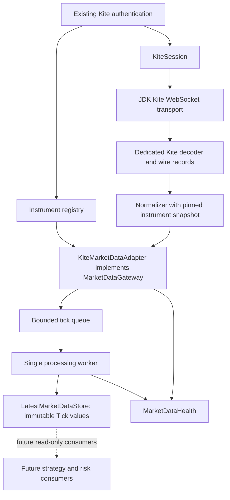
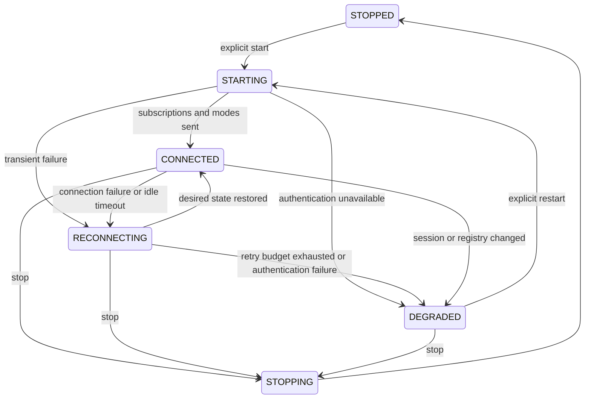

# Phase 4 market-data architecture

Phase 4 provides live market data only. It does not add strategies, signals, risk
decisions, order placement/modification/cancellation, order-update processing,
positions, P&L or automated trading. Authentication retains the existing official
browser flow, encrypted PostgreSQL token storage and restart restoration.

## Boundaries and values

Application consumers depend on `MarketDataGateway`, `LatestMarketDataStore`,
`MarketDataHealth`, `Tick`, `StreamMode`, and the existing `InstrumentId` value.
All Kite wire parsing, broker tokens, command encoding and credential use stay
in `broker.infrastructure.kite`. Domain types have no Spring, transport or broker
dependency. The implementation adds no Maven dependencies: it uses Java 21's
asynchronous WebSocket client, the existing Jackson stack and Micrometer.

`Tick` extends the existing domain value with `receivedAt`, optional exchange
timestamp, optional quote/OHLC and optional depth. Monetary values are
`BigDecimal`, quantities are nonnegative integral units, and timestamps are UTC
`Instant`. LTP contains no fabricated volume, OHLC, depth or exchange timestamp.
Index quotes can contain OHLC without traded volume/quantity. Full depth retains
the supplied bid/ask slots, including zero placeholders. Wire-only fields stay
out of the normalized domain.

The store atomically replaces an instrument's immutable tick. Exchange times
order updates when both are available; otherwise receive times do. Equal exchange
times use receive times as a tiebreaker. Distinct ticks with identical timestamps
follow publication order because older/newer cannot be established; identical
records are duplicates. A snapshot is an immutable map of requested known IDs,
with atomic values per instrument and weak consistency across instruments.
Historical last values remain readable after stop, unsubscribe or connection
loss; consumers must inspect health before treating them as current.

## Lifecycle and subscriptions

The gateway serializes lifecycle and desired-state changes and fences callbacks,
timers and pending ticks from older connections. Repeated start is idempotent.
`stop()` preserves desired subscriptions for a later explicit start; `close()`
also shuts down its executors. No automatic live connection occurs at startup.

Subscriptions are explicit sets of platform instrument IDs and typed modes.
Validation rejects unresolved IDs, non-Kite/invalid mappings and the configured
subscription limit before changing desired state. Commands are deduplicated and
tokens sorted for deterministic broker messages. LTP is the default; callers
request QUOTE or FULL only when those additional fields are needed. Desired modes
survive reconnect. CONNECTED means the desired subscription/mode commands have
been sent successfully; freshness still requires actual ticks.

Each connection pins an instrument snapshot so token reuse or registry refresh
cannot silently remap data. A registry version change degrades the gateway.
Stop and explicitly start against the refreshed registry; resolve desired
instruments again when their identities have changed.

Authentication comes exclusively from the runtime `KiteSession`. Missing or
expired authentication fails without a network retry loop. Classified broker
authentication failures invalidate only the session generation used by that
connection. A late failure from an old connection cannot invalidate a new login.
The market-data layer never generates an access token. A replacement/reset
session requires an explicit restart using the authentication subsystem's state.
The session publishes an immutable infrastructure-only view for streaming checks;
WebSocket callbacks never wait on the monitor held by existing REST requests.
Authentication rejection is generation-fenced and immediately visible to the
stream; synchronized session access applies the same rejection to REST state.

## Protocol, concurrency and failure handling

The fixed production endpoint is the official Kite WebSocket service. Binary
messages carry ticks and one-byte heartbeats; text messages carry broker updates.
The decoder supports LTP, quote/full, index quote/full, packet counts/lengths,
OHLC, timestamps and depth. It validates the complete binary frame before
publication and rejects malformed/truncated/unsupported packets. Normalization
uses exact segment-specific decimal scaling. See the
[official Kite protocol](https://kite.trade/docs/connect/v3/websocket/).

Message assembly and decoding have explicit frame/packet limits. Receive callbacks
do no REST calls, database writes, strategy work or blocking queue puts. A bounded
queue hands immutable normalized ticks to one processing worker. Overflow drops
the newest event, increments `marketdata.events.dropped` and latches BACKPRESSURE
quality degradation. Decode failure latches MALFORMED_DATA. Later successful ticks
do not erase a known gap: an explicit stop/start resets the quality latch. This
phase does not backfill lost events or promise lossless delivery.
Normalization validates the complete batch before handoff. An exchange timestamp
more than five seconds ahead of receive time is rejected as malformed, preventing
a corrupt future timestamp from suppressing later valid updates. Keep the host
clock synchronized. Subscription revisions fence queued ticks across mode changes
and unsubscribe/resubscribe cycles.

Reconnect uses capped exponential backoff with equal jitter, a bounded attempt
budget and injectable timing/randomness for tests. A successful connection with
subscriptions restored resets the consecutive attempt count. Stop cancels pending
retries. Authentication failures do not retry indefinitely. Idle timeout measures
messages, while staleness measures each desired instrument's data age.

Order postbacks, alerts and unknown text are counted and ignored as market data;
there is no order-domain dispatch. Broker error text can degrade quality and
classified authentication text stops the connection. Raw broker text, exceptions
containing connection details, API secrets, access tokens and authenticated URLs
are never logged or returned by diagnostics.

## Health and metrics

`MarketDataHealth` distinguishes STOPPED, STARTING, NO_DATA, FRESH, STALE,
RECONNECTING, DEGRADED and STOPPING. FRESH requires a current tick for every desired
instrument from the active connection and accepted subscription mode. Receive
age and any supplied exchange age must meet `stale-after`. An empty subscription
set, a missing first tick, or unsynchronized desired state remains NO_DATA.
Heartbeats update message activity but never tick freshness. Exchange calendars
are not assumed: outside active trading, connected feeds may be NO_DATA or STALE.

Status metadata includes connection timestamps, last message/tick timestamps,
desired/active counts, reconnect attempts, decode failures, received frames/ticks,
dropped events, ignored text and queue size. These are operational observations,
never trading authorization. `/actuator/marketdatastatus` requires explicit exposure
and stays separate from existing database/process readiness.

Micrometer publishes `marketdata.connection.state` (gateway enum ordinal),
`marketdata.frames.received`, `marketdata.ticks.received`,
`marketdata.decode.failures`, `marketdata.reconnects`, `marketdata.subscriptions`
(only `kind=desired|active`), `marketdata.last.tick.age` (seconds; NaN before data),
`marketdata.events.dropped`, `marketdata.queue.size`, `marketdata.text.ignored` and
`marketdata.ticks.rejected`. There are no instrument/token/symbol metric labels.
Connection, reconnect, subscription, bounded decode summaries and freshness
transitions use credential-safe structured logs.

See [configuration](../../config/README.md#market-data) and the
[market-data runbook](../runbooks/market-data.md) for explicit local use and recovery.
