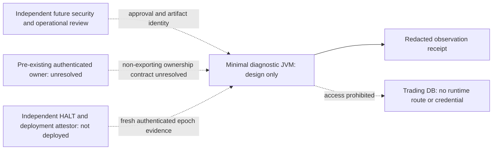

# ADR: minimal read-only diagnostic deployment

Phase 13.5E, 2026-10-10. Source baseline
3b7dafdc32834e963e68e4cdaacd9c8972dd037f. Decision: **B is the future target;
C remains the synthetic verification environment; operational NO_GO.**
Status: DESIGNED_NOT_DEPLOYED. No standalone executable, module, image, session
loader or official-origin activation is introduced. This uses the user's explicit
documentation-only option. Existing fixtures are executable regression evidence,
not a new deployment artifact or independent operational certificate.

## The root constraint and decision

A funds GET does not intrinsically need a trading database. The current Phase 13.5
harness nevertheless requires a database observer and unchanged trading-state
proof because that was the approved operational contract. Repeated snapshot and
lock tests cannot turn that contract into a global writer-exclusion mechanism.

For a future **observation-only** deployment, prefer removal of database authority
by construction over freezing the trading database. A separate process would have
no JDBC driver/connection, database credential, token-store mount, trading service,
order route or application bootstrap. It could claim only that its own admitted
code has no trading-store mutation path. It could not claim that other processes
did not write, that account funds are atomic/stable, or that funding is eligible.

This is a proposed change of assurance contract, not a waiver of today's guards.
The old Stage B approval still requires its original live isolation and baselines.
No DB-free invocation is authorized by that approval. If a future reviewer still
requires global trading-state invariance, B alone cannot meet it: independently
enforced writer exclusion and an external observer remain necessary, otherwise
NO_GO. Do not replace the integrity guard with a constant witness or call the
adapter directly as a shortcut.

There is a second independent blocker: a pre-existing authenticated KiteSession
cannot move between JVMs through private object references. B has no reviewed way
to own such a session without a separately scoped authentication design. No token
file, environment variable, CLI secret, serialized session or IPC bearer transfer
is acceptable. Both assurance contract and ownership must be resolved before code
for a live deployment is justified.

## Alternatives

| Candidate | Ownership / startup | Database and execution boundary | Decision |
|---|---|---|---|
| A: existing trading JVM | Session may already exist, but normal Spring runner calls restore; shared memory/agents and operator services remain | Disabling a controller does not remove writable connections, order code or competing threads | Reject as diagnostic deployment |
| B: minimal separate JVM | No Spring Boot main, runner, token lifecycle or automatic credential source; real ownership unresolved | Proposed dependency/OS allowlist and no trading DB access; only observation authority | Select future target, not deployed |
| C: isolated synthetic environment | Fixture installs synthetic token and locally marks profile validated; no real account | Loopback HTTP and independent Testcontainers DB; test-admin privileges exist only for fixture setup/fault injection | Select current verification scope |

An alternative remote request service retaining credentials in an existing trading
JVM avoids token copying but inherits A's execution/startup authority. It requires
its own independently reviewed owner isolation and authenticated narrow delegation;
it is not an implemented or accepted shortcut. No parallel Kite client is proposed.

## Proposed boundaries

No edge represents an active connection or implemented IPC. The future HTTP boundary
would permit only separately approved equity observation. Current executable tests
use literal loopback peers only; there is no executable real-origin configuration.

## Concrete source constraints and proposed dependency allowlist

All Java paths below are under apps/trading-core/src/main/java/com/kitehybrid/platform.

- broker/infrastructure/kite/KiteInfrastructureConfiguration defines
  restoreKiteAuthentication(ApplicationRunner), which calls authentication.restore().
  No normal Spring bootstrap is safe merely because diagnostics are read-only.
- KiteEquityReadHarness constructor requires KiteEquityReadIntegrity, a session,
  HALT, clock and request factory. Its run captures before/after database evidence.
  There is no DB-free mode. DISABLED and enum labels are not external authorization.
- KiteEquityReadHandoff constructor rejects officialOrigin; consume binds exact
  private owner/recipient, GET/path, session identity, HALT epoch, expiry and lease.
  It cannot be exported into B. Preserve this rejection and lifecycle unchanged.
- KiteEquityMarginReadAdapter is disabled by default, session-bound, with private
  snapshot/owner and a redacted observation. Reusing it alone would omit the harness
  proof. Its SYNTHETIC_TRANSPORT provenance never becomes account attestation.
- KiteRestTransport.controlledEquity reuses the existing transport. The shared
  class also contains order methods; KiteSession also has market-data credential
  support and a legacy constructor that can install configured credentials.
  Packaging these entire classes does not establish physical least authority.
- Existing architecture tests constrain calls/dependencies, not a separately
  packaged classpath, hostile reflection, Java agents or OS-administrator access.

Future packaging must explicitly allow only the observation model/parser, bounded
read transport, non-exportable owner capability, clock/epoch checks and redacted
receipt. Reject bootstrap, operator/order/risk-approval/strategy/WebSocket services,
Spring scanning/runners, auth restoration/exchange/reset, token repositories,
JDBC/migrations, arbitrary URL/SQL/command execution, credential environment loaders,
metrics payload export and debugging agents. A reviewer must decide whether a
small interface extraction can reuse the existing client without introducing a
second client or making execution classes loadable. No extraction is done here.

## Gap-to-control map

| Gap | Already validated | Designed here | Independent evidence / implementation still needed |
|---|---|---|---|
| Database dependence | Mandatory observer and mutation detection | Remove runtime DB authority for a different observation-only contract | Review narrower claim and old approval incompatibility; no guard bypass |
| Credential ownership | Same-process reference possession and session fencing | Owner-only capability issuance in a minimal runtime | Legitimate interactive-auth history/account binding and secure in-process ownership origin |
| Package isolation | Diagnostic call graph excludes execution/startup | Minimal distribution allowlist and rejected dependencies | Build/loadability audit and runtime artifact digest; current full jar is insufficient |
| HALT | Known vs unknown startup, epoch/revocation | Independent authenticated all-runtime attestation | Actual issuer, scope, freshness/revocation and conflicting-instance handling |
| Other writers | NOLOGIN/drain/lock/snapshot counterexamples | Separate own-write prevention from global invariance | Global exclusion remains absent; external control if invariance is required |
| Logging sinks | Sensitive markers/serialization; late wire DEBUG denial | Allowlisted appenders/sinks plus deployment containment | Unexpected file/network appender denial is not currently implemented |
| Process boundary | Cooperative child-process tests | Nonprivileged owner, closed environment, restricted filesystem/egress | No minimal process/image, sink ACL or host/container enforcement proof |

## Ownership contract, lifecycle and failure states

Only an independently authenticated owner may issue a future capability. Required
proof: legitimate interactive authentication provenance, intended account binding,
session execution identity, owner process/deployment identity and trusted recipient.
Proof must be current, scoped and independently verifiable; neither a UUID nor
profileValidated called by local code supplies it. Access tokens remain private to
their authenticated owner; no portable session artifact or bearer IPC is allowed.

Existing synthetic capability behavior supplies a reusable lifecycle: issue only
with known HALT/session/lease; bind owner and recipient references, exact route,
single attempt, creation/expiry and epoch; atomic consume chooses one winner;
wrong identity/recipient, clock reversal, expiry or revoked lease deny permanently.
Owner/recipient crash, restart, logout/auth rejection, token expiry or session/HALT
replacement invalidate. No recovery, restoration or retry replenishes the budget.
In-process reference equality is not cross-process authentication. Memory dumps,
debuggers and malicious same-JVM code require separate containment.

Proposed future synthetic standalone lifecycle (not an implemented main): closed
environment and role validation -> private temporary directory -> allowlisted
logging sinks -> synthetic session/HALT and disposable DB identity validation ->
one bounded handoff -> post-read checks -> redacted receipt -> idempotent resource
close. Reject unsolicited arguments, origins, credential variables and inherited
agents; never inspect or print their values. Proposed exit codes: 0 synthetic
success, 10 preflight rejected, 11 integrity failure, 12 unauthorized route,
13 isolation failure. Current Maven fixtures use Maven test exit semantics,
not these proposed codes. No operational launcher command is provided.

## HALT owner and attestation

RuntimeTradingHalt is process-local. knownHaltedAt(Epoch) rejects unavailable
startup signal and changed epoch while execution retains its fail-closed fallback.
Neither a new local latch nor a constant flag proves the trading runtime is halted.
The future independent controller must identify every execution-capable instance,
attest actual epoch and disabled authorization, authenticate issuer/recipient,
bind deployment/session scope and challenge, and define expiry/clock-skew/revocation.
Recheck before dispatch and after response. Concurrent changes discard results;
they cannot retract a request already received by a peer. No operational HALT
method is invoked and no live attestor is implemented.

## Writer threat matrix

| Writer/threat | C fixture evidence | DB-free B consequence / residual |
|---|---|---|
| Already-connected role after NOLOGIN | Can still update | B cannot write DB; other role still can |
| Newly connecting role after scoped drain | Enumerated role denied; privileged alternative connects | No global writer exclusion claim |
| Alternate/inherited roles | Effective UPDATE/TRIGGER rights deny observer | External clients remain outside runtime boundary |
| Superuser, triggers/functions, jobs | Privilege/function/session guard denial | DBA/system trust still needed for global invariance |
| Remote host, WSL/Docker, service/task/IDE launch | Visible connection may be detected at sampling | Network/process scan cannot cover future launches |
| Non-cooperative writer | Ignores file lock | Lock not part of prevention argument |
| Committed write then restoration; privilege grant then revoke | Equal snapshots can result | No atomic/stable balance or no-intervening-write claim |
| Drift during response | Post-read evidence attempted and result rejected | Revocation cannot undo the read already sent |

The chosen C fixture never contacts the trading DB, but that does not fence writers
on unrelated hosts. LIVE_WRITER_EXCLUSION_NOT_ESTABLISHED remains true. B's future
no-DB claim needs proof of absent credentials, mounts, JDBC, arbitrary network paths
and untrusted agents; none is established by merely omitting a connection string.
If the existing observer is retained, its fixed SELECT/SHOW, role/statistics checks,
content/count/schema hashes and private permission measurements still have races.
No real privileges or sessions may be changed under this design review.

## Host, log, network and retention controls

Future process owner must be nonprivileged with approved artifact and no inherited
JVM options/agents, database credentials or arbitrary settings. Verify command-line,
environment and filesystem ACL policy without emitting values. Dedicated work dir
must reject shared/reparse/symlink paths, use private permissions and retain no
bearer/session/payload. Docker readonly rootfs alone is insufficient: reject socket
mounts, host networking, privileged mode and secret-bearing shared volumes; review
WSL/host routes and actual egress enforcement. These are unimplemented requirements.

Startup and immediately-before-dispatch sink checks must enumerate actual logger
appenders and reject nonallowlisted file/network sinks, wire/header DEBUG and
unsafe dynamic changes. Current code only checks known wire/header debug loggers;
it does not implement a complete sink allowlist. Log ACL/retention, container log
drivers, proxies, heap/crash dumps and tracing agents need separate evidence.
No test result here is labeled as proof of those missing controls.

Existing request factory provides exact literal loopback route and single execute,
no redirects/retries and bounded parsing/timeouts. Official budget is process-wide;
synthetic factories are per-instance, fenced by one consumed handoff. There is no
new standalone process-wide synthetic budget, so do not claim that implementation.
Loopback outcome tests and official reservation-without-execute tests prove their
separate scopes only. Redacted receipts carry provenance/time, never authority.

Incident handling: stop before HTTP on missing prerequisites; after an attempt
reject unsafe evidence, close only owned resources, record bounded reason and
never retry/restore/repair DB. Retain only sanitized counts/status under approved
local policy; do not commit raw snapshots or private fingerprints. No live
retention/sink owner has yet attested compliance.

## Decision gate and next bounded work

Operational NO_GO. Do not repeat broad test expansion to solve ownership by proxy.
The next review must decide whether the narrower no-DB observation assurance is
acceptable, then specify legitimate non-exporting session ownership and minimal
packaging/sink enforcement. This requires an explicit new design scope, not real
account access. If rejected, retain the original all-writer/baseline requirements.
Only a later separately certified and explicitly authorized operation could send
a real request. Four collateral terms remain unproven and MIS NOT_READY regardless.
