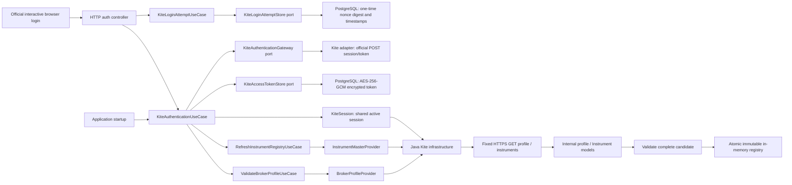

# Kite authentication, read-only REST and instrument reference data

These adapters do not implement BrokerAdapter, which is the separate execution
port. These REST adapters have no OMS connection, order operation or Python
change. [Phase 4 market data](kite-market-data.md) adds a separate WebSocket
adapter using the same authenticated session and instrument registry.

## Credentials and session

KiteProperties and KiteAuthenticationProperties bind KITE_REST_ENABLED (default
false), KITE_API_KEY, KITE_API_SECRET, KITE_REDIRECT_URL and
KITE_TOKEN_ENCRYPTION_KEY. Secret-bearing
objects have redacted string representations. Missing interactive authentication
is a recoverable startup state. Credential syntax/length checks prevent header
injection; error messages never include rejected values. KITE_ACCESS_TOKEN remains
an optional input for the legacy standalone diagnostic only.

The application layer owns KiteAuthenticationUseCase and the gateway, session
and token-store ports. It reuses ValidateBrokerProfileUseCase and
RefreshInstrumentRegistryUseCase. The thin HTTP controller handles browser state,
redirects and safe response codes; trading-domain types remain independent of
authentication, Spring, PostgreSQL and HTTP clients.

Login redirects to the official Kite Connect login page. KiteLoginAttemptUseCase
creates a 256-bit random nonce and persists only its SHA-256 digest, creation time
and ten-minute expiry through KiteLoginAttemptStore. Flyway V3 supplies the
`trading.kite_login_attempts` table, scoped by API-key digest. The controller puts
the nonce in a dedicated host-only HttpOnly SameSite=Lax cookie, Secure on HTTPS,
and the documented once-encoded `redirect_params` parameter. The callback must
carry matching state and cookie values. A constant-time comparison precedes one
atomic SQL DELETE restricted by digest, namespace, creation and expiry times.
Only the callback that deletes the row may proceed. No HttpSession or JSESSIONID
is consulted. Expired-row cleanup uses a bounded batch with SKIP LOCKED.

Outstanding attempts survive a restart within their original expiry when the
database, API key, callback origin and browser cookie remain available. Consumed
attempts stay invalid across restarts, including if exchange failed after
consumption. Missing state remains a rejection; cookie-only acceptance would
permit login CSRF. Database persistence does not explain or repair a parameter
missing from a broker redirect. See the
[callback runbook](../runbooks/kite-auth-callback.md).

The gateway exchanges the callback's one-time request token with
the configured API key and SHA-256 checksum using the API secret. Secrets and
token values never appear in application responses or logs. The browser completes
Zerodha credentials/TOTP and authorization; no private login API or automation is
used. See the [official authentication protocol](https://kite.trade/docs/connect/v3/user/).

The existing singleton KiteSession implements the session port. Its states are
DISABLED, NOT_CONFIGURED, AUTH_REQUIRED, UNVERIFIED, AUTHENTICATED and INVALIDATED.
The use case installs a candidate, validates it through the harmless profile
endpoint, and persists it only after validation. Successful authentication then
continues instrument initialization. AUTHENTICATED is prior profile validation,
not a guarantee that the broker cannot revoke a token or permission to place orders.

The PostgreSQL adapter uses the existing datasource and Flyway V2 table. An atomic
upsert stores AES-256-GCM ciphertext with a random nonce and issue/expiry times,
scoped to the configured API key's fingerprint. The 32-byte encryption key is
supplied separately from the database. Plaintext access tokens and request tokens
are never written to the database; request-token fingerprints for recent attempts
exist only in process memory.

On startup the use case loads the persisted token, rejects expired credentials,
and validates the session before continuing initialization. Expiry uses the daily
06:00 Asia/Kolkata cutoff independently of the host timezone. Authentication
rejections clear the stored token and require another browser login. Temporary
transport/broker failures preserve the durable token for a later validation attempt
and report KITE_AUTH_UNAVAILABLE. A reference-data failure reports initialization
pending and preserves the registry's previous snapshot.

The use case serializes restore, callback and local-reset operations; synchronized
KiteSession access coordinates broker reads and token changes. Recent callback
fingerprints remain a secondary guard against repeat exchanges. The HTTP boundary
consumes the durable login attempt first, so duplicate callbacks fail closed even
after restart or an ambiguous exchange timeout. Attempt consumption is atomic
across database clients; the active session and initialization still belong to
one local application process.
Local reset clears persistence/session only and does not perform account logout
or call the broker's session-revocation endpoint.

## Transport and failures

The adapter implements POST https://api.kite.trade/session/token,
GET https://api.kite.trade/user/profile and GET https://api.kite.trade/instruments.
Broker HTTP transport uses fixed destinations and disables redirects. The public
login route separately redirects the browser to the official login URL.
Connect timeout is 10 seconds;
socket read inactivity timeout is 30 seconds. No retries or scheduling.
Responses are bounded before and after gzip decompression: profile 64 KiB,
instrument master 32 MiB. Unknown encoding, invalid UTF-8, corrupt compression,
strict JSON failures and malformed CSV fail safely.

BrokerReadException exposes only a category and numeric HTTP status:
CONFIGURATION, AUTHENTICATION, BROKER_API, TRANSPORT, INVALID_RESPONSE.
Raw exceptions, headers, response bodies and upstream messages never cross the
adapter boundary. API-side NetworkException is a broker error; local I/O failure
is TRANSPORT. No real API response or credential is present in committed fixtures.

Profile retains only broker, user ID and exchanges; no email/name/tokens.
The CLI intentionally does not print account identity.

## Instrument mapping policy

Read CSV using BOM-aligned Jackson CSV. Validate required header names and reject
blank/duplicate headers. Accept reordered and additional columns; unrelated broker
fields are ignored. Enforce row width, quoting, required fields, plain decimal
syntax and strict dates. Never parse prices through double/float.

| Kite classification | Internal type / segment |
| --- | --- |
| EQ, segment matches exchange | CASH / CASH |
| EQ, segment INDICES | INDEX / INDICES |
| FUT, segment exchange-FUT (or documented MCX/MCX alias) | FUTURE / FUTURES |
| CE / PE, segment exchange-OPT | CALL_OPTION / PUT_OPTION / OPTIONS |

Unknown classifications reject the candidate, prompting an explicit mapping
decision instead of silent loss. Current token range is positive unsigned 32-bit.
Derivative expiry is required. Strike exists only for options; non-option CSV
strike may be blank or zero. Tick size and lot size are positive for tradable classifications.
INDEX permits zero lot/tick metadata; reference-data inclusion is never tradability.

The master last_price is not live market data and is intentionally ignored.
See ADR-012 for deterministic identity encoding and its limitations.

## Registry and refresh

Registry lookups use three immutable maps; normal queries do not scan a list.
A fresh registry has version 0, timestamp Instant.EPOCH, and empty maps.
InstrumentMasterProvider retrieves a complete internal candidate; registry validation
and indexing happen outside the HTTP mapping adapter. The configured singleton
refresh use case serializes retrieve → map → validate → publish.
Version increases only on publication; UTC snapshot timestamp comes from Clock.

Successful result: retrievedCount, acceptedCount, rejectedCount=0, snapshotVersion,
refreshedAt. All records must be accepted for a success result. Failure throws a
safe error (through the observable facade) and publishes nothing; no misleading
partial accepted count is returned. Prior snapshot remains unchanged.

One Instrument carries one broker mapping in this phase. Different brokers cannot
supply two rows for the same platform ID in a candidate; mapping aggregation is
deferred. Separate use-case instances must not race refreshes for one registry.
Consumers requiring consistency across several reads should capture snapshot()
once rather than call individual lookup methods across a concurrent refresh.

Synthetic tests exercise 1,114 instruments and concurrent publication. They
establish correctness, not a measured latency/throughput service-level objective.

## Observability and health

KiteReadOperations wraps profile/refresh calls with duration and result counters.
Registry count/version gauges have no identity labels. Logs contain only operation
and fixed result categories. No raw exceptions are passed to logging.

The public `/api/broker/kite/auth/status` endpoint reports only safe authentication
and initialization state. It does not return account details, secrets or tokens.
KiteStatusEndpoint reports passive session/snapshot state and tradingReady=false.
It is not exposed over HTTP by default and does not contribute DOWN to application
health. Normal health/liveness/readiness never trigger Kite calls. Management env
and configprops values are explicitly hidden even if later enabled; both endpoints
remain unexposed by default.

Trading safety defaults remain PAPER / live=false / emergency-stop=true.
No credential or successful diagnostic changes these defaults or enables trading.

## Explicit diagnostic scope

The Maven `exec:exec` diagnostic forks a standalone Java main using the selected
JDK 21. See the [diagnostic runbook](../runbooks/kite-rest-diagnostic.md) for commands.
It does not need PostgreSQL, Redis or Docker. It reads environment variables only.
The two commands are separate: instruments does not implicitly call profile.
The one-shot registry disappears when the command exits. A running application's
in-memory registry is refreshed through its application service, not by this
separate process. No public HTTP refresh endpoint or scheduler is added.
