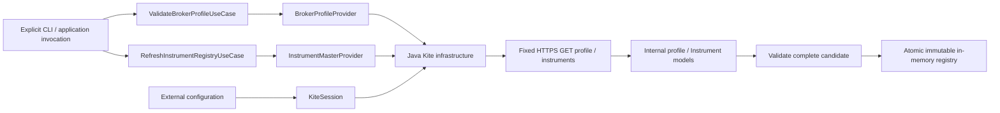

# Phase 2: read-only REST and instrument reference data

These adapters do not implement BrokerAdapter, which is the separate execution
port. There is no OMS connection, order operation, WebSocket or Python change.

## Credentials and session

KiteProperties binds KITE_REST_ENABLED (default false), KITE_API_KEY,
KITE_API_SECRET and KITE_ACCESS_TOKEN. It has no public secret getters and a
redacted toString. Missing/partial credentials are allowed at startup and rejected
with CONFIGURATION on explicit REST use. Credential syntax/length checks prevent
header injection; error messages never include rejected values.

API credentials identify an application. A request token comes from the
interactive broker login and is later exchanged for an access token. Only the
externally supplied access-token path is implemented. API secret is reserved
and not sent by these GETs. No request token is accepted, logged or stored.
No automatic browser login, token refresh, token exchange, logout or persistence.

Session states: DISABLED, NOT_CONFIGURED, UNVERIFIED, VALIDATED, INVALIDATED.
Successful profile mapping records VALIDATED. HTTP 401/403 or a TokenException
invalidates the session and blocks subsequent calls in that process.
Supply a newly obtained token and restart/reconstruct the session to recover.
VALIDATED describes prior profile validation, not an active probe or trading permission.
Kite may expire/invalidate a token at any time; no local expiry prediction is used.

## Transport and failures

Only GET https://api.kite.trade/user/profile and GET https://api.kite.trade/instruments
are implemented. No caller-provided URL or redirects. Connect timeout is 10 seconds;
socket read inactivity timeout is 30 seconds. No retries or scheduling.
Responses are bounded before and after gzip decompression: profile 64 KiB,
instrument master 32 MiB. Unknown encoding, invalid UTF-8, corrupt compression,
strict JSON failures and malformed CSV fail safely.

BrokerReadException exposes only a category and numeric HTTP status:
CONFIGURATION, AUTHENTICATION, BROKER_API, TRANSPORT, INVALID_RESPONSE.
Raw exceptions, headers, response bodies and upstream messages never cross the
adapter boundary. API-side NetworkException is a broker error; local I/O failure
is TRANSPORT. No real API response or credential is present in committed fixtures.

Profile retains only broker, user ID and exchanges; no email/name/tokens.
The CLI intentionally does not print account identity.

## Instrument mapping policy

Read CSV using BOM-aligned Jackson CSV. Validate required header names and reject
blank/duplicate headers. Accept reordered and additional columns; unrelated broker
fields are ignored. Enforce row width, quoting, required fields, plain decimal
syntax and strict dates. Never parse prices through double/float.

| Kite classification | Internal type / segment |
| --- | --- |
| EQ, segment matches exchange | CASH / CASH |
| EQ, segment INDICES | INDEX / INDICES |
| FUT, segment exchange-FUT (or documented MCX/MCX alias) | FUTURE / FUTURES |
| CE / PE, segment exchange-OPT | CALL_OPTION / PUT_OPTION / OPTIONS |

Unknown classifications reject the candidate, prompting an explicit mapping
decision instead of silent loss. Current token range is positive unsigned 32-bit.
Derivative expiry is required. Strike exists only for options; non-option CSV
strike may be blank or zero. Tick size and lot size are positive for tradable classifications.
INDEX permits zero lot/tick metadata; reference-data inclusion is never tradability.

The master last_price is not live market data and is intentionally ignored.
See ADR-012 for deterministic identity encoding and its limitations.

## Registry and refresh

Registry lookups use three immutable maps; normal queries do not scan a list.
A fresh registry has version 0, timestamp Instant.EPOCH, and empty maps.
InstrumentMasterProvider retrieves a complete internal candidate; registry validation
and indexing happen outside the HTTP mapping adapter. The configured singleton
refresh use case serializes retrieve → map → validate → publish.
Version increases only on publication; UTC snapshot timestamp comes from Clock.

Successful result: retrievedCount, acceptedCount, rejectedCount=0, snapshotVersion,
refreshedAt. All records must be accepted for a success result. Failure throws a
safe error (through the observable facade) and publishes nothing; no misleading
partial accepted count is returned. Prior snapshot remains unchanged.

One Instrument carries one broker mapping in this phase. Different brokers cannot
supply two rows for the same platform ID in a candidate; mapping aggregation is
deferred. Separate use-case instances must not race refreshes for one registry.
Consumers requiring consistency across several reads should capture snapshot()
once rather than call individual lookup methods across a concurrent refresh.

Synthetic tests exercise 1,114 instruments and concurrent publication. They
establish correctness, not a measured latency/throughput service-level objective.

## Observability and health

KiteReadOperations wraps profile/refresh calls with duration and result counters.
Registry count/version gauges have no identity labels. Logs contain only operation
and fixed result categories. No raw exceptions are passed to logging.

KiteStatusEndpoint reports passive session/snapshot state and tradingReady=false.
It is not exposed over HTTP by default and does not contribute DOWN to application
health. Normal health/liveness/readiness never trigger Kite calls. Management env
and configprops values are explicitly hidden even if later enabled; both endpoints
remain unexposed by default.

Trading safety defaults remain PAPER / live=false / emergency-stop=true.
No credential or successful diagnostic changes these defaults or enables trading.

## Explicit diagnostic scope

The Maven `exec:exec` diagnostic forks a standalone Java main using the selected
JDK 21. See the [diagnostic runbook](../runbooks/kite-rest-diagnostic.md) for commands.
It does not need PostgreSQL, Redis or Docker. It reads environment variables only.
The two commands are separate: instruments does not implicitly call profile.
The one-shot registry disappears when the command exits. A running application's
in-memory registry is refreshed through its application service, not by this
separate process. No public HTTP refresh endpoint or scheduler is added.
