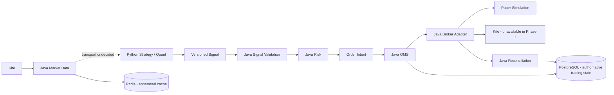

# System overview

Phase 1 establishes boundaries, contracts and testable foundations. Arrows below
describe the target trading architecture; no streaming transport or executable OMS exists.
Phase 2 adds only read-only Kite REST profile/instrument access and an immutable
registry. See [REST and instrument architecture](kite-rest-and-instruments.md).

Java is the control plane. Python is the strategy/quant plane. Python cannot
authenticate for trading, execute/modify/cancel orders, own authoritative orders
or positions, or bypass Java risk. Java owns all four execution modes.

## Modules and ownership

Implemented packages contain only actual types: bootstrap/config, shared identity,
instrument mapping, market-data ports, order lifecycle/models/repository port,
broker port, risk, health and one wire DTO adapter. Domain has no infrastructure,
Spring, Jackson or broker SDK dependency. ArchUnit protects this direction.

Future boundaries are documented here rather than represented by empty packages:

| Boundary | Responsibility |
| --- | --- |
| execution | risk-approved dispatch and adapter selection |
| position | sole authoritative position projection from fills |
| trade | trade/fill identity and accounting |
| portfolio | aggregate exposure and P&L from authoritative positions |
| reconciliation | broker comparison, explicit corrections, submission ambiguity |
| account | broker account scope and Java-only authentication |
| audit | durable control decisions and actor attribution |
| observability | metrics and structured operational events |

Python currently contains immutable signal models, strategy/signal-output protocols
and settings. Indicators, scanners, backtest, replay and optimization get packages
when they have real behavior. Strategies may consume read-only Java position
snapshots later, but never own or mutate the ledger.

## Identities, values and time

InstrumentId is an internal UUID. BrokerInstrumentId is a broker-scoped mapping;
tokens may be reused and must be resolved against an appropriate instrument master.
StrategyId is a bounded name. SignalId and order/intent IDs are distinct Java types.
BrokerOrderId and TradeId will be introduced with their actual models.

Quantity means positive whole instrument units (1..2,147,483,647), not lots or
signed exposure. Eligibility, lot size and quantity limits are future Java risk
checks. Prices/money use BigDecimal/Decimal; wire decimal values are strings.
Signal reference price is informational and cannot substitute for trusted market
data in production risk calculations.

Events use UTC Instant/datetime, with a microsecond wire precision ceiling.
Clock injection makes risk timing deterministic. Exchange calendars and session
timezones are deferred.

## Order lifecycle

OrderState defines legal edges and terminal states. Repeated notification of the
same state is a no-op. This is not fill/event deduplication: the eventual durable
ledger must atomically record event identity and state/version. Partial-fill
quantities and accounting are deliberately not implemented.

Cancellation can race with fills. Cancellation rejection can return to OPEN,
but the future aggregate must preserve cumulative fills. Out-of-order broker
notifications need a broker normalization/reconciliation policy.

FAILED represents a definite local submission failure only; network timeout or
unknown broker outcome must remain unresolved until reconciled, never be treated
as permission to resubmit. Terminal corrections use a separate reconciliation
operation, never ordinary lifecycle transitions.

## Risk and execution safety

RiskEngine composes ordered rules and stops on the first rejection or error.
Only emergency stop and positive reference price are implemented. Production
rules remain: eligibility, enabled strategies, duplicate identities, quantity,
order value, position/exposure, daily/strategy loss, stale data and broker health.

No controller, Python process or broker adapter executes orders in Phase 1.
Risk approval alone is not an execution capability. The future application
service must bind approval to the intent, durably deduplicate, and recheck halt
at dispatch. A configuration flag cannot make live trading operational.

## Market data

Gateway lifecycle: STOPPED, STARTING, CONNECTED, RECONNECTING, DEGRADED, STOPPING.
Subscription IDs are platform IDs; an adapter resolves broker tokens.
SDK callbacks must do bounded decoding/handoff only. TickSink.offer is
nonblocking and reports saturation. Future overload handling must count lost ticks,
mark freshness/quality degraded and block dependent trading as appropriate.
Strategies, indicators and database work run off the callback thread.
Queue sizing, ordering, reconnect/backfill and benchmarks are deferred.

## Persistence and recovery

PostgreSQL will own orders/events/fills/trades/positions/reconciliation.
OrderRepository describes conditional creation and version-aware state update;
no database implementation or in-memory production ledger exists.
A future adapter must atomically commit state, event identity and relevant
outbound delivery intent; no exactly-once delivery claim is made.

On future restart: begin halted, restore durable state, reconcile open/ambiguous
orders with the broker, rebuild projections, verify market-data freshness, and
require explicit permission before dispatch. Recovery is documented, not implemented.

Redis is optional ephemeral cache only, with no durable Compose volume.
Redis must not be a required source of truth for deduplication or risk.

## Deployment and security scope

Phase 1 is local development only, bound to loopback. Authentication/authorization
for future trading APIs and dashboards must be designed before exposure.
Management exposes health/info/Prometheus only. Credentials are required only for
explicit Phase 2 Kite REST reads; normal startup and tests do not need them.
No production messaging technology has been selected.
